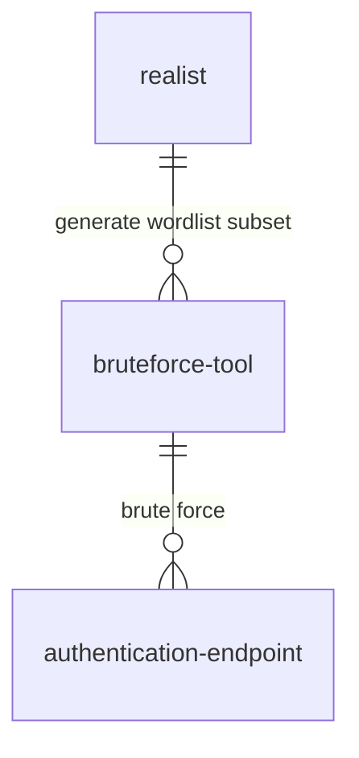

# realist

Constraint-based wordlist generator

***🚧 Work in progress...***

## Usage

The most password-based authentication systems now provide some constraints on password scheme (minimum password lenght, special character use,...). **`realist` is a simple tool to generate all the possible combinations taking in account those constraints *(thus preventing the generation of invalid scheme passwords)***.

For example, admitting the following constraints:
* Minimum password length: 7
* Minimum special character: 1
* Minimum uppercase character: 1
* Minimum lowercase character: 1
```shell
realist --min-len 7 --min-spe 1 --min-upper 1 --min-lower 1
# stdout the wordlist of all combinations
```

### Cloud computing

As the wordlist generation is a very long and resource intensive process, the idea is to split the computation into multiple instance. Hence, all instances will be in charge of a specific subset of the whole wordlist.

The use case is particularly interesting in case of you are able to monitor multiple servers/pc (so the cloud basically) and you are trying to perform brute-forcing. You are then able to **divide your "brute force" tasks in each  instances you are monitoring and be much faster**.

Below is the Brute forcing compute on each instance:



***Notes:*** Have to find a way to split wordlist generation in equal subset (~split cartesian product)
